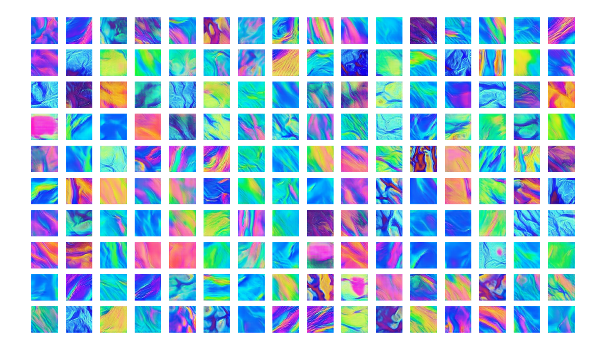

# Art created with artificial intelligence
A deep convolutional generative adversarial network (DCGAN) is trained on pictures of art. Images are procedurally created from the generative neural network by sampling the latent space. Information on the neural network architecture can be found here: https://arxiv.org/abs/1511.06434

## Dependencies
- [Python 3+](https://www.anaconda.com/distribution/)
- Tensorflow (tensorflow-gpu==1.14), Matplotlib, Numpy, PIL, Scikit-learn

## Pre-trained Models
Thin-Film Interference on the surface of a bubble - `bubble_train.py`

Video: https://www.reddit.com/r/generative/comments/gfv2gj/latent_explorations_thinfilm_inference_on_bubbles/

64 x 64 images from a latent space of 256 dimensions after 50000 training epochs



## Train your own model
1. Download your favorite images to a new directory
2. Change some parameters below like: `directory`, `name`, `latent_dim`, `epochs`, etc..
3. Run the code

```python 
from dcgan import DCGAN, create_dataset

if __name__ == '__main__':

    x_train, y_train = create_dataset(128,128, nSlices=150, resize=0.75, directory='space/')
    assert(x_train.shape[0]>0)

    x_train /= 255 

    dcgan = DCGAN(img_rows = x_train[0].shape[0],
                    img_cols = x_train[0].shape[1],
                    channels = x_train[0].shape[2], 
                    latent_dim=32,
                    name='nebula_32_128')
                    
    dcgan.train(x_train, epochs=10000, batch_size=32, save_interval=100)
```
The neural network will create outputs during the training process to the folder: `images/`. This process could take a while depending on your computer. For comparison the two pretrained models used 15000 training epochs which took ~1-2 hours on a GTX 1070. 
